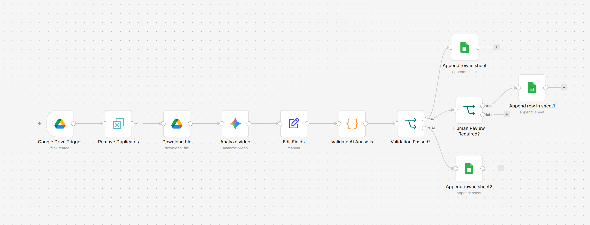
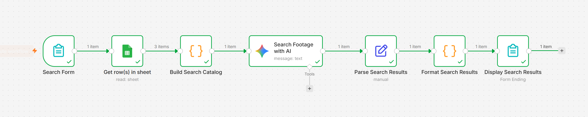
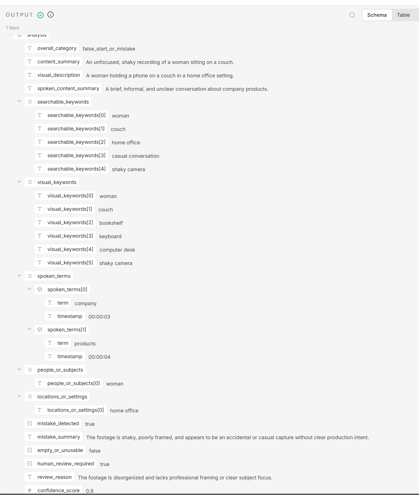
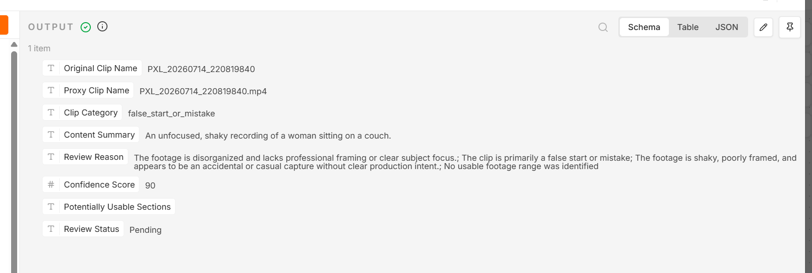
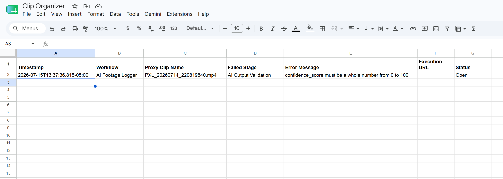

# AI Assistant Editor

An AI-powered footage intelligence system for post-production. It logs proxy video, detects questionable takes, creates searchable editorial metadata, routes uncertain results for human review, and lets an editor search the catalog in natural language.

Built as a TripleTen AI Automation capstone by [cutthatclip](https://github.com/cutthatclip).

> This is a working portfolio prototype, not an enterprise-ready media asset management system. Editors remain responsible for creative and final-use decisions.



## The problem

Before an editor can make creative choices, someone must review, describe, classify, and organize large amounts of raw footage. That first pass is repetitive but requires enough editorial judgment to distinguish a useful scene from setup, a camera test, a false start, or an incomplete take.

This project addresses two related bottlenecks:

1. **Footage logging:** watching every clip to identify its contents, spoken terms, potential usable sections, and production problems.
2. **Footage retrieval:** remembering which clip contains a particular subject, action, setting, or spoken phrase.

The system does not edit the video or replace the editor. It performs a structured first pass so the editor can focus review where judgment matters most.

## What the completed system does

The repository contains two connected n8n workflows:

### 1. AI footage logger

- Watches a Google Drive intake folder for a newly uploaded proxy.
- Prevents the same Google Drive file ID from being processed repeatedly.
- Downloads the proxy for analysis without moving or renaming Premiere's working media.
- Uses Gemini with a custom editorial prompt to classify and describe the clip.
- Separates broad visual/search concepts from words or phrases clearly spoken.
- Produces clip-relative timestamps for spoken terms and potentially usable sections.
- Parses Gemini's response into structured JSON.
- Validates required fields, allowed categories, data types, confidence, and timestamp formats.
- Normalizes common confidence formats such as `0.9` to `90`.
- Routes valid, confident clips to the main Clip Catalog.
- Routes valid but uncertain or problematic clips to a Human Review Queue.
- Routes malformed AI output to a structured Error Log.

### 2. Natural-language footage search

- Accepts an editor's request through an n8n form.
- Reads the completed Clip Catalog from Google Sheets.
- Deduplicates catalog rows by proxy or original clip name before search.
- Uses Gemini to rank supported semantic, visual, and spoken matches.
- Excludes rows marked `Processing Error`.
- Warns when a returned result still needs human review.
- Returns up to five ranked clips with a relevance score, matching timecode, and concise reason.
- Returns a clear no-match result rather than inventing footage.



## Completed vs. planned

| Capability | Status |
|---|---|
| Drive-triggered proxy intake | Completed |
| Duplicate prevention by Drive file ID | Completed |
| Gemini video classification and metadata extraction | Completed |
| Spoken terms separated from visual/search keywords | Completed |
| Clip-relative spoken and usable-section timestamps | Completed |
| Structured JSON parsing and validation | Completed |
| Clip Catalog, Human Review Queue, and validation Error Log | Completed |
| Natural-language catalog search with ranked/no-match responses | Completed |
| Direct Adobe Premiere bin, marker, or sequence changes | Planned |
| Source-media timecode and reel metadata integration | Planned |
| Automatic capture of Gemini API timeouts and hard node failures | Planned |

The planned hard-failure enhancement is deliberately not presented as completed: the Gemini node's error output should be connected to an error-normalization step and then to the Error Log sheet. The current Error Log captures **invalid structured AI output after Gemini returns a response**, not API timeouts or a Gemini node that fails before returning data.

## Architecture

Adobe Premiere Pro and Adobe Media Encoder remain responsible for professional ingest and the master/proxy relationship. The automation analyzes a copy of the linked proxy; it does not attach, move, rename, or replace Premiere's media.

```mermaid
flowchart LR
    subgraph Adobe["Professional media preparation — outside n8n"]
        A["Premiere Pro ingest"] --> B["Adobe Media Encoder creates linked proxy"]
        B --> C["Copy of proxy uploaded for analysis"]
    end

    subgraph Logger["Workflow 1 — AI footage logger"]
        C --> D["Google Drive trigger"]
        D --> E["Remove duplicate file IDs"]
        E --> F["Download proxy"]
        F --> G["Gemini video analysis"]
        G --> H["Parse structured JSON"]
        H --> I["Validate AI output"]
        I -->|"Valid + no review"| J["Clip Catalog"]
        I -->|"Valid + review"| K["Human Review Queue"]
        I -->|"Invalid output"| L["Error Log"]
    end

    subgraph Search["Workflow 2 — footage search"]
        M["Editor search form"] --> N["Read Clip Catalog"]
        N --> O["Build deduplicated search catalog"]
        O --> P["Gemini relevance ranking"]
        P --> Q["Parse and format results"]
        Q --> R["Ranked matches or no-match response"]
    end

    J -. "catalog source" .-> N
```



More detail is available in [the architecture document](docs/architecture.md).

## Technology stack

| Component | Purpose |
|---|---|
| n8n | Workflow orchestration, triggers, routing, parsing, validation, and forms |
| Google Drive | External proxy intake |
| Google Gemini | Multimodal video analysis and semantic search ranking |
| Google Sheets | Clip Catalog, Human Review Queue, and Error Log |
| JavaScript in n8n | Deterministic validation, catalog construction, deduplication support, and safe HTML formatting |
| Adobe Premiere Pro / Media Encoder | Professional ingest and linked proxy creation outside the automation |

The exported workflow currently references `models/gemini-3.1-flash-lite`. If that model is not available in another account or n8n version, select a video-capable Gemini model and retest the prompt and output contract.

## Input and output

### Footage logger input

- A proxy video copied into a configured Google Drive folder.
- Google Drive metadata, including file ID and filename.

### Structured AI output

The analysis includes:

- overall category
- concise content and visual descriptions
- searchable and visual keywords
- timecoded spoken terms
- people/subjects and locations/settings
- mistake and unusable flags
- human-review recommendation and reason
- confidence score
- potentially usable ranges
- segment-level metadata



### Editor-facing output

The main Google Sheet is intentionally concise: clip names, category, summary, visual description, timecoded spoken terms, searchable keywords, mistakes, potentially usable sections, confidence, status, and error information. A catalog screenshot containing personal spoken details was deliberately excluded from the public review copy.

The exact JSON and Sheet contracts are documented in [data-contract.md](docs/data-contract.md).

## Validation and human review

The JavaScript validation node checks the AI response independently of the model. A response must contain supported categories, required text and arrays, true/false fields, a whole-number confidence score from 0 to 100, valid `HH:MM:SS` spoken timestamps, and usable ranges with valid boundaries and reasons.

A structurally valid clip is still routed to review when any of these conditions apply:

- Gemini explicitly requests human review.
- confidence is below 80.
- category is `mixed`, `needs_human_review`, `false_start_or_mistake`, or `empty_or_unusable`.
- a possible mistake is detected.
- no usable range is identified.

This distinction matters: a clip can be analyzed with high confidence and still require an editor because it is confidently identified as a likely mistake.



## Error handling

Completed error handling covers malformed or unsupported AI output. Validation failures are logged with a timestamp, workflow name, proxy filename, failed stage, error message, optional execution URL, and status.



Current boundary: if the Gemini node itself times out or fails before returning a response, that failure is visible in n8n execution history but is not yet written into the Error Log sheet. Routing the Gemini node's error output into that sheet is a documented future enhancement.

## Testing performed

The prototype was tested with a small, deliberately varied sample rather than a production-scale media library:

| Scenario | Expected behavior | Observed result |
|---|---|---|
| Intentional dialogue scene | Complete catalog row | Passed |
| Direct-to-camera interview-style clip | Interview metadata and timecodes | Passed |
| Obvious false start / accidental-looking clip | Mistake classification and review route | Passed after prompt refinement |
| Same Drive file encountered again | Stop before Gemini analysis | Passed |
| Invalid confidence value in QC copy | Validation failure and Error Log row | Passed |
| Relevant natural-language query | Ranked clips with reasons and timecodes | Passed |
| Unsupported query | Clear no-match response | Passed |

The included QC workflow is an inactive testing copy used to demonstrate validation behavior. Test evidence and important caveats are recorded in [testing-and-quality-control.md](docs/testing-and-quality-control.md).

## Setup

See [setup.md](docs/setup.md) for the complete import and configuration procedure. At a high level:

1. Create Google OAuth credentials and enable the Google Drive and Google Sheets APIs.
2. Create a Gemini API key.
3. Create a Drive intake folder and a Google Sheet with `Clip Catalog`, `Review Queue`, and `Error Log` tabs.
4. Import the sanitized n8n JSON files.
5. Reconnect credentials and replace every `REPLACE_WITH_YOUR_...` placeholder.
6. Confirm the required Sheet column headers.
7. Select a video-capable Gemini model if the exported model is unavailable.
8. Test each workflow manually with non-sensitive sample media.
9. Publish only after all routes and outputs are verified.

The sanitized workflows are inactive on import and contain no working credentials or private Google resource identifiers.

## Current limitations

- The evaluation sample is small; accuracy has not been benchmarked at production scale.
- Model output can still misclassify editorial intent, so review routing is essential.
- Usable ranges are candidates, not final edit decisions.
- Timestamps are relative to the analysis proxy, not integrated source/reel timecode.
- The Sheet catalog is practical for a prototype but is not a vector database or media asset management platform.
- The workflow does not create Premiere bins, markers, selects sequences, or proxy attachments.
- The automation relies on a consistent clip/proxy naming relationship supplied by the Adobe workflow.
- Video size, duration, model availability, API cost, and rate limits depend on the configured Gemini account and model.
- Gemini API timeouts and hard node failures are not yet copied into the Error Log sheet.

## Future improvements

1. **Gemini hard-failure route:** connect the Gemini node's error output to an error-normalization node and append timeouts/API failures to the existing Error Log sheet.
2. **Adobe Premiere integration:** use an officially supported extension/API to create bins or markers only after reliable filename and timecode mapping is demonstrated.
3. **Source metadata:** add exact original filename, reel, source timecode, and proxy mapping from an Adobe-generated manifest rather than inference.
4. **Larger evaluation set:** measure category accuracy, false-start detection, timestamp tolerance, search precision, and review-rate by footage type.
5. **Human feedback loop:** save editor corrections and use them to improve prompts, thresholds, and evaluation cases.
6. **Scalable retrieval:** move from full-catalog prompting to indexed or vector-based retrieval when the catalog outgrows the Sheet-based prototype.

## Development approach

I defined the product concept, professional problem, workflow design, project scope, routing logic, test cases, and product decisions based on my post-production experience. AI tools assisted heavily with implementation details, JavaScript, prompt drafting and refinement, debugging, workflow guidance, and documentation. I tested the system, challenged incorrect results, and made the final decisions about what the product should and should not claim.

## Repository Structure

```text
ai-assistant-editor/
|-- .gitignore
|-- README.md
|-- assets/
|   `-- screenshots/
|       |-- footage-logger-workflow.png
|       |-- footage-search-workflow.png
|       |-- human-review-queue.png
|       |-- structured-ai-output.png
|       `-- validation-error-log.png
|-- docs/
|   |-- architecture.md
|   |-- data-contract.md
|   |-- sanitization-report.md
|   |-- setup.md
|   `-- testing-and-quality-control.md
|-- prompts/
|   |-- footage-analysis-prompt.md
|   `-- search-ranking-prompt.md
`-- workflows/
    |-- ai-footage-logger.sanitized.json
    |-- footage-search-assistant.sanitized.json
    `-- testing/
        `-- ai-footage-logger-qc-test.sanitized.json

## Security and privacy

The portfolio exports replace credentials, account identifiers, webhook IDs, Drive folder IDs, spreadsheet IDs, tab IDs, URLs, and n8n ownership/version metadata with nonfunctional placeholders. Sample videos are not included. Presentation files and browser screenshots containing temporary signed localhost form URLs are also excluded.

Review [sanitization-report.md](docs/sanitization-report.md) before making a fork or derivative repository public.

## License

No open-source license has been selected yet. Until one is added, normal copyright restrictions apply.

