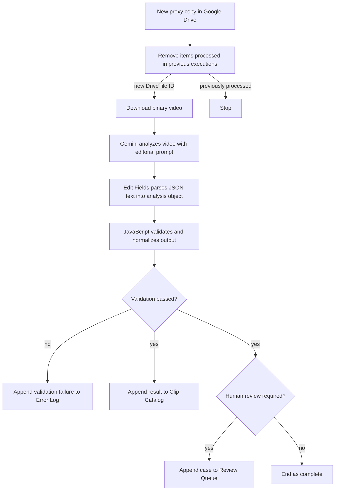
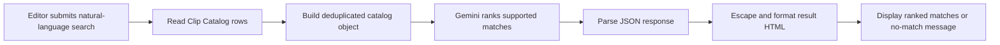

# Architecture

## System boundary

The project intentionally separates professional media management from AI analysis.

### Adobe-owned media workflow

Premiere Pro and Adobe Media Encoder create and maintain the original/proxy relationship. The editor may copy a linked proxy into the Google Drive analysis folder, but the automation does not move, rename, attach, relink, or replace Premiere's working media.

### n8n-owned intelligence workflow

n8n coordinates the intake copy, Gemini analysis, deterministic validation, Google Sheets outputs, and editor search experience.

## Workflow 1: AI footage logger



### Why both the catalog and review queue can receive a clip

A valid AI result can still require human review. The main catalog preserves the searchable analysis, while the separate review queue identifies the subset that needs an editor's attention. An invalid response does not enter the clean catalog; it is sent to the Error Log.

### Validation responsibilities

The deterministic JavaScript step:

- normalizes a numeric string or 0–1 confidence value into a 0–100 whole number;
- checks required text, arrays, and true/false values;
- restricts the overall category to supported values;
- validates `HH:MM:SS` spoken timestamps;
- validates usable-range boundaries and reasons;
- creates `Complete`, `Needs Review`, or `Processing Error` status;
- collects review reasons without duplicates.

## Workflow 2: Footage search assistant



The search prompt asks Gemini to distinguish a visual match from an exact spoken match, return no more than five results with relevance of at least 60, copy filenames and timecodes from the catalog, exclude `Processing Error`, and avoid inventing results.

## Services and data flow

| Boundary | Data entering | Data leaving |
|---|---|---|
| Google Drive → n8n | Drive file metadata and proxy binary | One n8n item per new file |
| n8n → Gemini analysis | Proxy binary and custom editorial prompt | JSON text containing clip metadata |
| n8n → Google Sheets | Validated, flattened editor-facing fields | Catalog, review, or error row |
| Google Sheets → n8n search | Completed Clip Catalog rows | Deduplicated catalog JSON |
| n8n → Gemini search | Search query and catalog JSON | Ranked matches or no-match JSON |
| n8n → editor | Escaped HTML | Search-results page |

## Completed error boundary

The current logger catches a returned Gemini response that violates the expected data contract. It does not yet catch a Gemini node that fails before returning data.

## Planned error boundary

Connect the Gemini node's error output to a small normalization step that creates the existing Error Log fields:

```text
Timestamp
Workflow
Proxy Clip Name
Failed Stage
Error Message
Execution URL
Status
```

That planned route should record timeouts, authentication errors, rate limits, file-processing errors, and other hard API failures. It is intentionally documented as future work.

